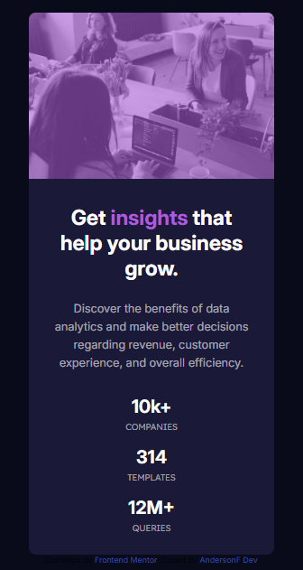

# Frontend Mentor - Stats preview card component solution

Esta é uma solução para o [Desafio do componente do cartão de visualização de estatísticas no Frontend Mentor](https://www.frontendmentor.io/challenges/recipe-page-KiTsR8QQKm). Os desafios do Frontend Mentor ajudam você a melhorar suas habilidades de codificação construindo projetos realistas.


### Screenshot

[]

[]


### Link


- URL do site ativo: [link aqui](https://andersonf-dev.github.io/stats-preview-card-component/)


### Criado com

- Marcação HTML5 semântica
- Propriedades personalizadas CSS


### O que aprendi

Aprendi a criar um card, posicionar elementos na tela centralizar e o sar o ::after e o  (order:) 


```css
    .conteiner .img-capa {
    background: url('../images/image-header-desktop.jpg') center center no-repeat;
    background-size: cover;
    width: 544px;

    border-top-right-radius: 10px;
    border-bottom-right-radius: 10px;
    position: relative;
}

.conteiner .img-capa::after{
    content: '';
    background-color:  hsla(277, 64%, 61%, 0.575);

    width: 100%;
    height: 100%;
    
    border-top-right-radius: 10px;
    border-bottom-right-radius: 10px;
    position: absolute;
    
}
```

### Desenvolvimento contínuo

Este foi nono de muitos dos projetos do frontend Mentorque fiz. Continuarei fazendo e me desenvolvendo ainda mais. Estou aprendendo cada dia mais, fazendo esses desafios, 
